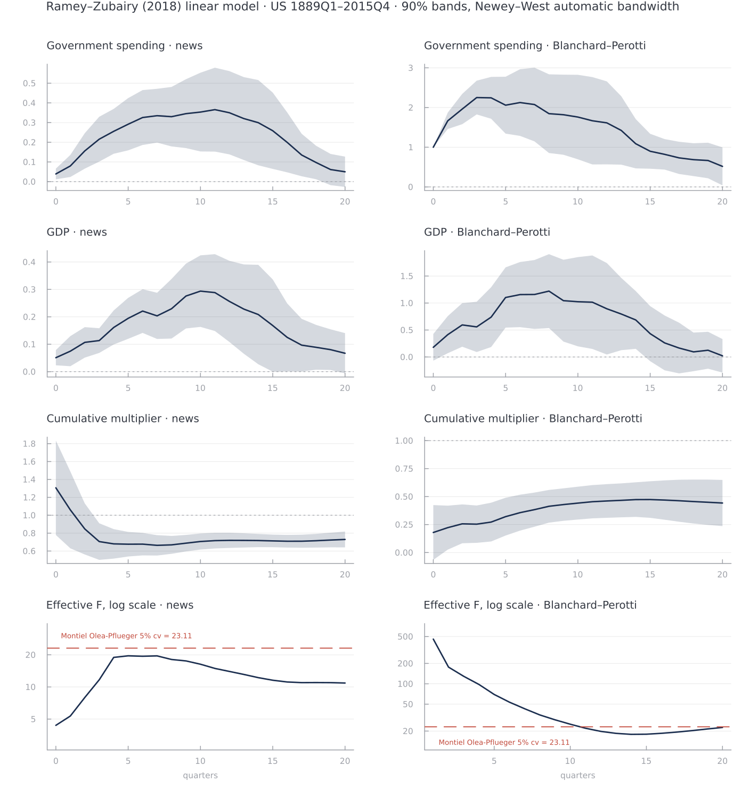

# LocalProjections.jl

[](https://github.com/andrerecio/LocalProjections.jl/actions/workflows/CI.yml) [](http://codecov.io/github/andrerecio/LocalProjections.jl?branch=main) [](https://github.com/JuliaTesting/Aqua.jl)  

Impulse response functions by local projections (Jordà, 2005): horizon-specific
linear regressions with a formula interface, robust and HAR inference,
small-sample bias correction, bootstrap confidence bands, and
instrumental-variable support.

This is a fork of [gragusa/LocalProjections.jl](https://github.com/gragusa/LocalProjections.jl)
that extends the inference procedures: equal-weighted-cosine (EWC) HAR
inference with Student-`t` critical values, the Herbst–Johannsen bias
correction, the VAR residual moving-block bootstrap with VAR lag selection,
and horizon-tracking regressors for cumulative multipliers.

## Contents

  - [Installation](#installation)
  - [Quick start](#quick-start)
  - [Formula interface](#formula-interface)
  - [Inference](#inference)
  - [Bias correction](#bias-correction)
  - [Lag selection](#lag-selection)
  - [Bootstrap inference](#bootstrap-inference)
  - [Instrumental variables](#instrumental-variables)
  - [Worked example: Ramey–Zubairy (2018)](#worked-example-rameyzubairy-2018)
  - [Plotting](#plotting)
  - [Scope and known limitations](#scope-and-known-limitations)
  - [Development](#development)

## Installation

```julia
using Pkg
Pkg.add(url = "https://github.com/andrerecio/LocalProjections.jl")
```

Julia 1.11 or newer is required. Two dependencies, `Regress.jl` and
`MacroEconometricTools.jl`, are unregistered and are resolved from GitHub
automatically.

## Quick start

```julia
using LocalProjections, DataFrames, StatsModels, CovarianceMatrices, Plots

# Simulated data: y responds to cumulated shocks
n = 200
shock = randn(n)
y = cumsum(shock) + 0.5 * randn(n)
df = DataFrame(y = y, shock = shock)

# y_{t+h} = α_h + θ_h·shock_t + controls,  h = 0, …, 20
lp_result = lp(@formula(leads(y) ~ shock + lags(y, 2)), df; horizon = 20)

coefpath(lp_result; term = :shock)                              # θ_0, …, θ_20
summarize(lp_result, Bartlett{NeweyWest}(); level = 0.90)       # table with bands
plot(lp_result, Bartlett{NeweyWest}(); term = :shock, levels = [0.68, 0.95])
```

## Formula interface

The left-hand side selects how the response is transformed at each horizon:

| LHS                               | Response at horizon `h` |
| --------------------------------- | ----------------------- |
| `leads(y)`                        | `y[t+h]`                |
| `cumul(y)`                        | `y[t] + ⋯ + y[t+h]`     |
| `anchor(y, z)` (or `leads(y)\|z`) | `y[t+h] − z[t]`         |

A plain left-hand side is rejected: a local projection needs one of the three.
The right-hand side accepts `lags(x, n)`, interactions, and the usual
StatsModels transformations. The right-hand-side design is built once and
reused at every horizon, unless it contains a horizon-tracking term.

### Horizon-tracking regressors

`cumul(x)` and `leads(x)` may also appear on the right-hand side, in OLS and
IV formulas alike. There they *track the projection horizon*: at horizon `h`
the column is rebuilt as `x[t] + ⋯ + x[t+h]` (or `x[t+h]`) instead of being
computed once. Writing an explicit horizon, `cumul(x, 3)`, pins the column and
it then behaves like any fixed regressor.

```julia
# Cumulative multiplier: cumulative y on cumulative g through the same horizon,
# with g instrumented by a shock. One call gives the whole path.
mult = lpiv(@formula(cumul(y) ~ (cumul(g) ~ shock) + lags(y, 4) + lags(g, 4)),
            df; horizon = 20)
```

The coefficient keeps the horizon-free name `cumul(g)`, so `coefpath`,
`summarize` and the plot recipes work unchanged. The estimand of such a
regression is a multiplier, not an impulse response, which is why
`biascorrect` and `varbootstrap` reject formulas that contain one.

## Inference

Any covariance estimator from
[CovarianceMatrices.jl](https://github.com/gragusa/CovarianceMatrices.jl) is
applied horizon by horizon. Two equivalent idioms are available:
`vcov(estimator, lp_result)` and `lp_result + vcov(estimator)`. `summarize`
returns coefficients, standard errors and confidence bands as a table:

```julia
# Heteroskedasticity-robust (Eicker–Huber–White, HC1)
summarize(lp_result, HC1(); level = 0.90)

# HAC with a fixed Bartlett bandwidth, or with Newey–West (1994) automatic selection
summarize(lp_result, Bartlett(30.0); level = 0.90)
summarize(lp_result, Bartlett{NeweyWest}(); level = 0.90)

# Equal-weighted cosine (EWC) HAR inference, Lazarus–Lewis–Stock–Watson (2018)
B = ewc_bandwidth(lp_result)        # B = ⌊0.41·T₀^(2/3)⌋ from the h = 0 sample
summarize(lp_result, EWC(B); level = 0.90)
```

Confidence bands use the critical values canonically paired with the
estimator: Student-`t_B` for `EWC(B)` (fixed-smoothing asymptotics), standard
normal otherwise. The same rule applies in `summarize`, `plot` and
`as_irf_result`.

For lower-level access, compute the covariance once and reuse it:

```julia
cov_ewc = vcov(EWC(B), lp_result)
se = stderror(cov_ewc; term = :shock)
plot(lp_result, cov_ewc; term = :shock, levels = [0.90])
```

The horizon-`h` residual of a local projection is a moving average of order
`h` by construction, so a fixed, horizon-aware HAC bandwidth is usually the
defensible choice. Section 8 of
[the inference guide](docs/src/inference_procedures_guide.md) documents why
the automatic Newey–West rule does not reproduce Stata's `ivreg2, bw(auto)`.

## Bias correction

`biascorrect` applies the Herbst–Johannsen (2024) small-sample correction to
the impulse-response path (the "BCC" estimator). The persistence of the
controls is estimated from the horizon-zero regression, and each horizon is
corrected recursively through the already-corrected lower horizons:

```julia
bc = biascorrect(lp_result)         # OLS local projections only
coefpath(bc)                        # corrected θ̂ᶜ path (θ̂₀ unchanged)
summarize(bc, HC1(); level = 0.90)  # bands centered on θ̂ᶜ
```

Following the reference implementation (Montiel Olea, Plagborg-Møller, Qian &
Wolf, 2025), the bands are centered on the corrected path but use the standard
errors of the *uncorrected* coefficients. `plot` and `as_irf_result` accept
the corrected result anywhere a plain one is accepted. The correction requires
the same regressors at every horizon and a horizon-`h` sample that is the
horizon-zero sample minus its last `h` rows; anything else is rejected with an
explanation.

## Lag selection

`lagselect` chooses the lag order of a reduced-form VAR by an information
criterion, following `ic_var.m` in the Montiel Olea, Plagborg-Møller, Qian &
Wolf (2025) replication suite. A single order is selected for the whole system
and used both for the local-projection controls and for the bootstrap VAR:

```julia
sel = lagselect(df, [:shock, :y]; maxlags = 10, criterion = :aic)
nlags(sel)          # selected p
DataFrame(sel)      # the full AIC/BIC path over p = 1:maxlags
```

`@formula` takes a literal lag count, so the selected `p` cannot be spliced in
programmatically: read it off `nlags(sel)`, write it into the formula, and pass
the same value as `nlags` to `varbootstrap` so the controls and the bootstrap
VAR agree.

With `n` variables and `T` observations,

```
AIC(p) = logdet Σ̂ₚ + 2(n²p + n) / (T − p_max)
BIC(p) = logdet Σ̂ₚ + (n²p + n)·log(T − p_max) / (T − p_max)
```

Both criteria are always computed; `criterion` only decides which one is
minimized. Two conventions are inherited deliberately from the reference: the
penalty denominator is the fixed `T − p_max` for every `p`, so the criteria are
comparable across the grid, while `Σ̂ₚ` is estimated on the full sample. The
grid starts at `p = 1`.

## Bootstrap inference

`varbootstrap` implements the VAR residual moving-block bootstrap with Hall
percentile-`t` bands. A reduced-form VAR is fitted and used as the bootstrap
data-generating process. In each draw its residuals are resampled in
overlapping blocks with position-specific recentering
(Brüggemann–Jentsch–Trenkler), the VAR is iterated from randomly drawn
contiguous initial conditions, and **the complete local projection is
re-estimated** on the artificial sample:

```julia
# nlags(sel) was 4 here, so the formula uses lags(·, 4) to match.
m = lp(@formula(leads(y) ~ shock + lags(y, 4) + lags(shock, 4)), df; horizon = 20)

b = varbootstrap(m, df; vars = [:shock, :y], nlags = 4,
                 nboot = 1000, rng = Xoshiro(20260831))

summarize(b; level = 0.90)              # Hall percentile-t bands
plot(b; levels = [0.68, 0.90])
```

`vars` is the VAR data vector in identification order. It must contain the
shock and every variable the formula refers to, since the local projection is
rebuilt in each draw. The block length defaults to `ceil(5.03·T^(1/4))`, the
reference rule.

By default both analytical corrections are applied, which together give the
procedure the reference recommends:

  - `popecorrect = true`: Pope (1990) bias-corrected VAR slopes as the
    bootstrap data-generating process (intercept and residuals stay the OLS ones);
  - `biascorrect = true`: the Herbst–Johannsen correction applied to the
    real-data path *and* to every bootstrap path.

Setting both to `false` reproduces the simpler uncorrected variant.

Three centers are involved and should not be confused:

| Object                                 | Center used                        |
| -------------------------------------- | ---------------------------------- |
| Reported response                      | bias-corrected LP, `θ̂ᶜ`            |
| Bootstrap responses                    | bias-corrected bootstrap LP        |
| Center of the bootstrap `t`-statistic  | Pope-corrected VAR pseudo-truth    |

Centering the statistic at the VAR-implied response, not at the real-data LP
estimate, is essential: the fitted VAR is what generates the bootstrap samples.
`summarize` also accepts `method = :hall` or `method = :efron` for the other
two constructions in `boot_ci.m`.

Bands are **pointwise across horizons, not simultaneous**, and are generally
asymmetric around the point estimate. They may also fail to *contain* it: the
percentile-`t` and Hall constructions both correct for bias, so a shifted
bootstrap `t`-distribution can push the whole interval to one side of `θ̂`. In
the Monte Carlo study under `benchmark/coverage_study.jl` this happens in at
most 0.3% of horizon-replications.

Draws in which the LP cannot be estimated are counted in `b.nfail` and excluded
from the quantiles. Because the Pope correction carries stability safeguards it
may be attenuated or skipped entirely; inspect `b.pope_delta` (`1.0` full,
`0.0` skipped). On near-unit-root data the full correction applies in only
about three quarters of samples.

Per-draw seeds are drawn from `rng` before the loop, so results are
reproducible and identical whether or not `threaded = true` is passed. On a
typical macro sample (T ≈ 240, horizon 20) a draw costs about a millisecond,
dominated by rebuilding the StatsModels design rather than by linear algebra.

## Instrumental variables

`lpiv` estimates local projections with endogenous regressors using
`(endogenous ~ instruments)` syntax, with first-stage diagnostics and the
Montiel Olea–Pflueger weak-instrument test:

```julia
# x is endogenous, z is its instrument
result = lpiv(@formula(leads(y) ~ (x ~ z) + lags(y, 2)), df; horizon = 10)

first_stage(result, 0)                                # first stage at horizon 0
weakivtest(result + vcov(Bartlett{NeweyWest}()), 0)   # effective F and critical values
```

`weakivtest` uses the covariance estimator attached to the model. Kernel HAC
estimators and CR0/CR1 cluster estimators are supported; anything else,
notably `EWC`, is rejected with a warning because the Montiel Olea–Pflueger
critical values assume a consistently estimated weight matrix, which
fixed-smoothing estimators do not provide.

## Worked example: Ramey–Zubairy (2018)



The baseline linear model of Ramey and Zubairy (2018, *JPE*) on US quarterly
data, 1889Q1–2015Q4. The cleaned dataset ships as
`docs/src/data/ramey_zubairy.csv`, with the variable definitions of the
authors' `jordagk.do`:

```julia
using LocalProjections, DataFrames, CSV, StatsModels, CovarianceMatrices

rz = CSV.read("docs/src/data/ramey_zubairy.csv", DataFrame; missingstring = "")
rz.bp = rz.g                       # Blanchard–Perotti shock: current spending

# Impulse responses of government spending and GDP to the military-news shock
irf = lp(@formula(leads(g) ~ newsy + lags(newsy, 4) + lags(y, 4) + lags(g, 4)),
         rz; horizon = 20)
summarize(irf, Bartlett(30.0); term = :newsy, level = 0.90)

# One-step cumulative multiplier: cumulative GDP on cumulative spending through
# the same horizon, spending instrumented by the news shock.
mult = lpiv(@formula(cumul(y) ~ (cumul(g) ~ newsy) +
                     lags(newsy, 4) + lags(y, 4) + lags(g, 4)), rz; horizon = 20)
summarize(mult, Bartlett(30.0); level = 0.90)

# Weak-instrument diagnostic at the two-year horizon
weakivtest(mult + vcov(Bartlett{NeweyWest}()), 8)
```

The two-year multiplier is **0.67** for the military-news shock and **0.41**
for Blanchard–Perotti, below one as in the paper. The estimation samples match
Stata's exactly, and every point estimate lands within 0.19 published standard
errors of the authors' value. The news instrument never clears the Montiel
Olea–Pflueger 5% critical value (the effective *F* peaks at 19.6 at five
quarters), and Blanchard–Perotti falls below it from horizon 11 on.

The figure uses the automatic Newey–West bandwidth; the fixed `Bartlett(30.0)`
above is what reproduces the published standard errors, for the reasons given
in section 8 of the inference guide. Regenerate the figure with
`julia --project=docs docs/make_rz_figure.jl`. The full walkthrough, including
the two-step multiplier and a table against the published numbers, is in
[the tutorial](docs/src/tutorials/ramey_zubairy.md).

## Plotting

Plots.jl recipes cover every result type: `plot(lp, estimator_or_cov; term,
levels)` for OLS, IV and bias-corrected results, and `plot(b; levels, method)`
for bootstrap bands. Loading Makie enables `irfplot`, `irfplot!` and
`irfplot_axis` through a package extension. `as_irf_result` converts any
result into the `LocalProjectionIRFResult` type of MacroEconometricTools.jl.

## Scope and known limitations

  - **Internal `missing` values.** `lp` and `lpiv` drop rows with `missing`
    base variables *before* building lags and leads, so a gap inside the sample
    collapses the time axis and produces time-incorrect lags. Encode internal
    gaps as `NaN` instead; rows are then masked per horizon.
  - **Bootstrap and bias correction scope.** Both are defined for OLS local
    projections with `leads` or `cumul` responses and a horizon-invariant
    regressor set. Anchored responses, `lpiv` results and horizon-tracking
    regressors are rejected with an explanation. The VAR columns must be free
    of `missing` and `NaN`.
  - **HAC keyword forwarding.** `vcov` does not forward keyword arguments such
    as `dofadjust` to the per-horizon models, and the upstream estimators ignore
    it for HAC and EWC in any case.
  - **Stateful HAC estimators.** A `Bartlett{NeweyWest}()` instance caches one
    kernel weight per moment column on first use. Create a fresh instance for
    every model with a different regressor count rather than sharing one.

The mathematical background, the mapping to the reference MATLAB
implementation, and the audit behind these notes are in
[`docs/src/inference_procedures_guide.md`](docs/src/inference_procedures_guide.md).

## Development

```bash
julia --project -e 'using Pkg; Pkg.test()'            # tests (TestItemRunner + Aqua)
julia --project=dev dev/format.jl                      # SciML formatting, required before pushing
julia --project=docs docs/make.jl                      # local docs build
julia --project=benchmark benchmark/run_asv.jl         # benchmarks
julia --project=benchmark -t 4 benchmark/coverage_study.jl   # bootstrap coverage study
```

Test items are tagged (`:vcov`, `:ewc`, `:biascorr`, `:bootstrap`,
`:lagselect`, `:lpiv`, …) and can be run in isolation with TestItemRunner.

## License

MIT License. See [LICENSE](LICENSE) for details.
