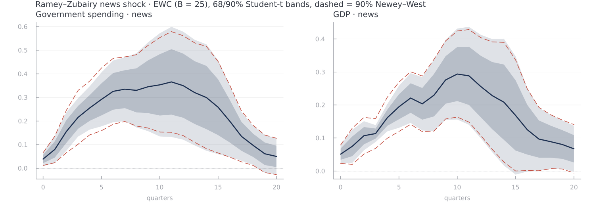
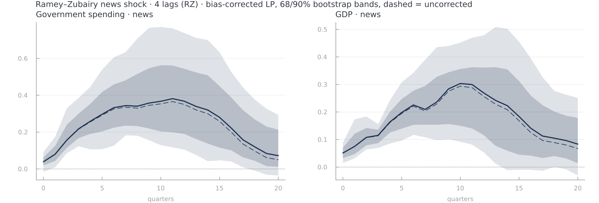
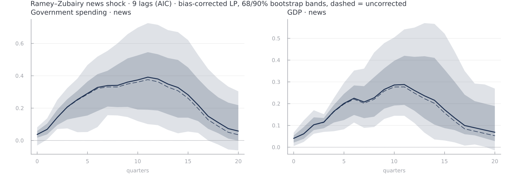

# Tutorial 4: Ramey–Zubairy Cumulative Fiscal Multipliers

This tutorial replicates the **baseline (linear) cumulative government-spending
multipliers** of Ramey and Zubairy (2018, *JPE*), "Government Spending
Multipliers in Good Times and in Bad: Evidence from US Historical Data".

The reference implementation is the Stata program `jordagk.do` in the authors'
replication package. Its "ESTIMATION OF CUMULATIVE" block is what we reproduce
here.

## The estimand

Ramey and Zubairy use the Gordon–Krenn normalisation: every variable is divided
by an estimate of *potential* GDP, so that regression coefficients are already
in dollar-for-dollar units and no ex-post conversion factor is needed. With

```math
y_t = \frac{\text{real GDP}_t}{\text{potential GDP}_t},
\qquad
g_t = \frac{\text{nominal gov.\ purchases}_t / P_t}{\text{potential GDP}_t},
```

the *one-step* cumulative multiplier at horizon ``h`` is the coefficient
``m_h`` in the 2SLS regression

```math
\sum_{j=0}^{h} y_{t+j}
  \;=\; m_h \sum_{j=0}^{h} g_{t+j}
  \;+\; \gamma' w_{t-1} \;+\; u_{t+h},
\qquad
\sum_{j=0}^{h} g_{t+j} \ \text{ instrumented by the shock } s_t ,
```

where ``w_{t-1}`` collects four lags of the controls and a constant. Two shocks
are used:

| Shock | Instrument ``s_t`` | Controls ``w_{t-1}`` |
|---|---|---|
| Military news | `newsy` ``= \text{news}_t / (\text{potential GDP}_{t-1} P_{t-1})`` | 4 lags of `newsy`, `y`, `g` |
| Blanchard–Perotti | `g` (current spending, taken as predetermined) | 4 lags of `y`, `g` |

This is *not* the "two-step" multiplier — the ratio of the cumulative sums of
separately estimated impulse responses — which Ramey and Zubairy also report and
which is computed further below.

## The dataset

`docs/src/data/ramey_zubairy.csv` is the cleaned analysis file, built from
`rzdatnew.csv` in the replication package with exactly the variable definitions
of `jordagk.do`. It is quarterly, 1889Q1–2015Q4 (508 observations).

| Column | Definition (`jordagk.do`) |
|---|---|
| `quarter` | date as a decimal year (`1889.0`, `1889.25`, …) |
| `y` | `rgdp / rgdp_pott6` |
| `g` | `(ngov / pgdp) / rgdp_pott6` |
| `newsy` | `news / (L.rgdp_pott6 * L.pgdp)` |
| `taxy` | `nfedcurrreceipts_nipa / ngdp` |
| `debty` | `pubfeddebt_treas / L.ngdp` |
| `infl` | `400 * D.log(pgdp)` |
| `unemp` | civilian unemployment rate |
| `slack` | `unemp >= 6.5` |
| `zlb` | `zlb_dummy` |
| `recession` | NBER recession indicator |
| `wwii` | `quarter >= 1941.5 & quarter < 1946` (rationing period) |
| `ag` | Auerbach–Gorodnichenko state, `exp(-1.5 z)/(1 + exp(-1.5 z))` |
| `y_cbo`, `g_cbo`, `newsy_cbo` | as above but normalised by `rgdp_potcbo` |

Two conventions are worth flagging:

* Pre-1889 rows are dropped **before** any lag or lead is formed, exactly as in
  `jordagk.do`, so `L.` at 1889Q1 is missing and `newsy` starts in 1890Q1.
* Stata evaluates `gen slack = unemp >= 6.5` to `1` when `unemp` is missing.
  We emit `missing` instead. The two differ only over 1889Q1–1889Q4. No linear
  or news-shock regression reaches those rows, but the state-dependent
  Blanchard–Perotti regressions start in 1890Q1 and read the state of 1889Q4:
  Stata places that quarter in the slack regime, here it drops out. See the
  state-dependence section below.

## Estimation

The endogenous regressor ``\sum_{j=0}^{h} g_{t+j}`` moves with the horizon, and
so does the response. Both are expressed with `cumul`, which tracks the
projection horizon on either side of the formula (see the "Horizon-tracking
right-hand-side terms" note in the [`lpiv`](@ref) docstring), so the whole
multiplier path is one call:

```julia
using LocalProjections, DataFrames, CSV
using StatsModels: @formula
using CovarianceMatrices: Bartlett, NeweyWest

rz = CSV.read(joinpath(@__DIR__, "..", "data", "ramey_zubairy.csv"),
              DataFrame; missingstring = "")
rz.bp = rz.g          # Blanchard-Perotti shock: current spending

news = lpiv(@formula(cumul(y) ~ (cumul(g) ~ newsy) +
                     lags(newsy, 4) + lags(y, 4) + lags(g, 4)), rz; horizon = 20)

bp   = lpiv(@formula(cumul(y) ~ (cumul(g) ~ bp) +
                     lags(y, 4) + lags(g, 4)), rz; horizon = 20)

summarize(news, vcov(Bartlett{NeweyWest}(), news))   # multiplier path, s.e. and bands
summarize(bp,   vcov(Bartlett{NeweyWest}(), bp))
```

The multiplier is the coefficient on `cumul(g)`, which is what `shock` picks by
default, so `summarize` needs no `term`. The design `lpiv` builds is exactly
the one `ivreg2` builds for
`ivreg2 f{h}cumuly (f{h}cumulg = bp) L(1/4).y L(1/4).g` — a constant, four lags
of each control, and the cumulative-spending regressor last:

```julia
julia> bp.coef_names
10-element Vector{String}:
 "(Intercept)"
 "y_lag1"
 "y_lag2"
 "y_lag3"
 "y_lag4"
 "g_lag1"
 "g_lag2"
 "g_lag3"
 "g_lag4"
 "cumul(g)"

julia> [m.nobs for m in bp.models][[1, 9, 21]]   # h = 0, 8, 20
3-element Vector{Int64}:
 504
 496
 484
```

Those sample sizes are Stata's exactly: 1890Q1 through 2015Q4 minus the horizon.

## Results

Full sample, 1889Q1–2015Q4, four lags, no trends, no tax controls, WWII
rationing *not* omitted — the shipped defaults of `jordagk.do`. `RZ` is the
authors' published `multlin1`/`seylin` from
`Multiplier-Standard-Errors.xlsx`. Standard errors use the automatic
Newey–West bandwidth.

| h | news | s.e. | RZ | RZ s.e. | BP | s.e. | RZ | RZ s.e. |
|---:|---:|---:|---:|---:|---:|---:|---:|---:|
| 0 | 1.306 | 0.321 | 1.255 | 0.329 | 0.179 | 0.149 | 0.208 | 0.155 |
| 1 | 1.060 | 0.261 | 1.035 | 0.235 | 0.223 | 0.119 | 0.235 | 0.143 |
| 2 | 0.847 | 0.173 | 0.820 | 0.155 | 0.257 | 0.106 | 0.257 | 0.133 |
| 3 | 0.706 | 0.124 | 0.695 | 0.123 | 0.254 | 0.101 | 0.251 | 0.133 |
| 4 | 0.680 | 0.100 | 0.674 | 0.097 | 0.272 | 0.105 | 0.271 | 0.132 |
| 6 | 0.677 | 0.076 | 0.673 | 0.074 | 0.356 | 0.098 | 0.353 | 0.119 |
| **8** | **0.669** | 0.061 | 0.667 | 0.060 | **0.413** | 0.089 | 0.411 | 0.104 |
| 10 | 0.706 | 0.055 | 0.705 | 0.053 | 0.442 | 0.089 | 0.439 | 0.102 |
| 12 | 0.719 | 0.051 | 0.717 | 0.052 | 0.461 | 0.091 | 0.458 | 0.102 |
| 14 | 0.717 | 0.045 | 0.716 | 0.046 | 0.473 | 0.094 | 0.471 | 0.105 |
| **16** | **0.710** | 0.043 | 0.708 | 0.046 | **0.469** | 0.107 | 0.467 | 0.119 |
| 18 | 0.715 | 0.046 | 0.713 | 0.053 | 0.456 | 0.119 | 0.453 | 0.133 |
| 20 | 0.729 | 0.054 | 0.727 | 0.063 | 0.443 | 0.125 | 0.440 | 0.139 |

Horizons 8 and 16 are the two-year and four-year multipliers reported in the
paper. The headline finding reproduces: the multiplier is well below one over
the full sample — about 0.67 at two years for the news shock and about 0.41 for
the Blanchard–Perotti shock.

Every point estimate lands within **0.19 published standard errors** of the
authors' value, with a median deviation of 0.03 standard errors across the two
shocks and 21 horizons. The residual gap is most likely a data-vintage
difference: `Multiplier-Standard-Errors.xlsx` is dated 21 November 2016 while
the shipped `RZDAT.xlsx` was revised on 28 November 2016.

## Standard errors

The published standard errors come from `ivreg2 …, robust bw(auto)`. Both that
and `CovarianceMatrices.Bartlett{NeweyWest}` implement the Newey–West (1994)
automatic bandwidth, and they agree on the kernel, on what the bandwidth
parameter means, and on the absence of a degrees-of-freedom correction, but
the two implementations select different bandwidths on the same regression.
Over the full grid the standard errors above are 0.76–1.12 times the published
ones. Section 8 of [the inference guide](../inference_procedures_guide.md)
gives the exact formula each side implements and measures the difference
horizon by horizon.

## The two-step multiplier

The alternative Ramey–Zubairy estimator takes the ratio of the cumulative sums
of the separately estimated impulse responses of `y` and `g`.

```julia
function twostep_multiplier(rz, shock::Symbol; hmax = 20)
    fy, fg = shock === :newsy ?
        (@formula(leads(y) ~ newsy + lags(newsy, 4) + lags(y, 4) + lags(g, 4)),
         @formula(leads(g) ~ newsy + lags(newsy, 4) + lags(y, 4) + lags(g, 4))) :
        (@formula(leads(y) ~ bp + lags(y, 4) + lags(g, 4)),
         @formula(leads(g) ~ bp + lags(y, 4) + lags(g, 4)))
    ry, rg = lp(fy, rz; horizon = hmax), lp(fg, rz; horizon = hmax)
    by = coefpath(ry; term = shock)
    bg = coefpath(rg; term = shock)
    DataFrame(h = 0:hmax, irf_y = by, irf_g = bg,
              multiplier = cumsum(by) ./ cumsum(bg))
end
```

The two estimators agree closely here — the largest gap across the 21 horizons
is 0.0031 for the news shock and 0.0004 for the Blanchard–Perotti shock —
because the one-step regressions run on the same sample as the
impulse-response regressions. Ramey and Zubairy note that in other
specifications the two diverge, and the reason is precisely that the samples
differ.

## HAR inference for the impulse responses

The Newey–West bands above pair a kernel variance estimator with normal
critical values. Lazarus, Lewis, Stock & Watson (2018) recommend instead the
equal-weighted-cosine (EWC) estimator with
``B = \lfloor 0.41\, T_0^{2/3} \rfloor`` cosine terms, paired with
Student-``t_B`` critical values from fixed-smoothing asymptotics. [`ewc_bandwidth`](@ref) computes ``B`` from the
horizon-zero sample, and `summarize`, `plot` and `as_irf_result` switch to the
``t_B`` critical values whenever the estimator is `EWC(B)`.

The figure shows the news-shock impulse responses behind the two-step
multiplier with 68% and 90% EWC bands. The point estimates are unchanged; the
dashed lines are the 90% automatic Newey–West band with normal critical values,
for comparison.



```julia
using Plots
using CovarianceMatrices: EWC

irf_y = lp(@formula(leads(y) ~ newsy + lags(newsy, 4) + lags(y, 4) + lags(g, 4)),
           rz; horizon = 20)
irf_g = lp(@formula(leads(g) ~ newsy + lags(newsy, 4) + lags(y, 4) + lags(g, 4)),
           rz; horizon = 20)

B = ewc_bandwidth(irf_g)            # 25, from the T₀ = 500 rows of the h = 0 sample

summarize(irf_y, EWC(B); term = :newsy, level = 0.90)     # Student-t₂₅ bands
plot(irf_g, EWC(B); term = :newsy, levels = [0.68, 0.90])
```

With ``B = 25`` the 90% critical value is 1.708 instead of the normal 1.645. At
the peaks the EWC standard errors are 2–5% above the Newey–West ones, so the
band around the GDP peak of 0.29 at ten quarters widens from [0.16, 0.42] to
[0.16, 0.43], and the one around the spending peak of 0.37 at eleven quarters
from [0.15, 0.58] to [0.13, 0.60]. At short horizons the ranking reverses:
between two and five quarters the EWC standard errors are 13–45% smaller.

The conclusions barely move. The spending band excludes zero through horizon
18 under both procedures, and the GDP band through horizon 14; after that it
includes zero at horizons 15–16, where Newey–West only does so at 15. The
figure is regenerated by `julia --project=docs docs/make_rz_ewc_figure.jl`.

EWC inference is confined to the impulse responses here. `weakivtest` rejects
`EWC`, because the Montiel Olea–Pflueger critical values assume a consistently
estimated weight matrix, so the weak-instrument diagnostic of the multiplier
regressions stays on the kernel HAC covariance.

## Bias correction and bootstrap bands for the impulse responses

The impulse responses behind the two-step multiplier are OLS local projections,
so they can be run through the procedure the Montiel Olea, Plagborg-Møller,
Qian & Wolf (2025) replication suite recommends: the Herbst–Johannsen
[`biascorrect`](@ref) applied to the path, and [`varbootstrap`](@ref), the VAR
residual moving-block bootstrap with a Pope-corrected data-generating process
and Hall percentile-``t`` bands. Both corrections are on by default. The
multiplier regressions themselves are out of scope: `varbootstrap` rejects
`lpiv` results and horizon-tracking regressors.

The VAR columns must be free of `missing` values. `newsy` starts in 1890Q1, so
the four leading rows are dropped; the local-projection samples are unchanged
because those rows never enter any regression.

### Four lags: the Ramey–Zubairy specification



```julia
using Random, Plots

rzc = dropmissing(rz, [:newsy, :y, :g])

irf_y = lp(@formula(leads(y) ~ newsy + lags(newsy, 4) + lags(y, 4) + lags(g, 4)),
           rzc; horizon = 20)
irf_g = lp(@formula(leads(g) ~ newsy + lags(newsy, 4) + lags(y, 4) + lags(g, 4)),
           rzc; horizon = 20)

# Same seed for both responses: identical artificial samples.
boot_y = varbootstrap(irf_y, rzc; vars = [:newsy, :y, :g], nlags = 4,
                      nboot = 1000, rng = Xoshiro(20260916))
boot_g = varbootstrap(irf_g, rzc; vars = [:newsy, :y, :g], nlags = 4,
                      nboot = 1000, rng = Xoshiro(20260916))

summarize(boot_y; level = 0.90)     # bias-corrected path, Hall percentile-t bands
plot(boot_g; levels = [0.68, 0.90])
```

`vars` is the VAR data vector in identification order, shock first. It must
contain every variable the formula refers to, since the complete local
projection is re-estimated in each draw.

Both responses are hump-shaped: GDP peaks at about 0.30 ten quarters after the
shock, spending at about 0.38 after eleven. The bias correction raises the
paths by at most 0.02 on this long sample, which is the gap between the solid
and dashed lines in the figure. The 90% band for GDP excludes zero through
horizon 13, the one for spending from horizon 1 to 17. All 1000 draws estimate
successfully (`boot_y.nfail == 0`) and the Pope correction applies in full
(`boot_y.pope_delta == 1.0`).

### Lag order selected by AIC

The reference selects the VAR order by AIC over ``p = 1, \dots, 10`` and uses
it both for the local-projection controls and for the bootstrap VAR.
[`lagselect`](@ref) ports that rule:



```julia
sel = lagselect(rzc, [:newsy, :y, :g]; maxlags = 10, criterion = :aic)
nlags(sel)                          # 9  (BIC would pick 2)
DataFrame(sel)                      # the AIC and BIC paths over p = 1:10

irf_y = lp(@formula(leads(y) ~ newsy + lags(newsy, 9) + lags(y, 9) + lags(g, 9)),
           rzc; horizon = 20)
irf_g = lp(@formula(leads(g) ~ newsy + lags(newsy, 9) + lags(y, 9) + lags(g, 9)),
           rzc; horizon = 20)

boot_y = varbootstrap(irf_y, rzc; vars = [:newsy, :y, :g], nlags = 9,
                      nboot = 1000, rng = Xoshiro(20260916))
boot_g = varbootstrap(irf_g, rzc; vars = [:newsy, :y, :g], nlags = 9,
                      nboot = 1000, rng = Xoshiro(20260916))

summarize(boot_y; level = 0.90)
plot(boot_g; levels = [0.68, 0.90])
```

`@formula` takes a literal lag count, so the selected order is read off
`nlags(sel)` and written into the formula by hand; the same value goes to
`nlags` in `varbootstrap` so the controls and the bootstrap VAR agree.

The extra lags leave the shape intact. Both responses now peak eleven quarters
out, at about 0.29 for GDP and 0.39 for spending. The bands widen at long
horizons and become right-skewed: at the GDP peak the upper half-width is
nearly twice the lower one. The GDP band excludes zero through horizon 19 and
the spending band from horizon 1 to 16. Again no draw fails and the Pope
correction applies in full.

Bands are pointwise across horizons, not simultaneous. Each bootstrap of 1000
draws takes a few seconds. The figures are regenerated by
`julia --project=docs docs/make_rz_bootstrap_figure.jl`.

## State-dependent multipliers

The question in the paper's title is whether the multiplier is larger when
there is slack. Ramey and Zubairy let every coefficient depend on the state of
the economy in the *previous* quarter, ``I_{t-1} = 1`` when unemployment was at
or above 6.5%:

```math
\sum_{j=0}^{h} y_{t+j}
  = (1 - I_{t-1}) \Big[ \alpha_{A,h} + m_{A,h} \sum_{j=0}^{h} g_{t+j} + \gamma_{A,h}' w_{t-1} \Big]
  + I_{t-1} \Big[ \alpha_{B,h} + m_{B,h} \sum_{j=0}^{h} g_{t+j} + \gamma_{B,h}' w_{t-1} \Big]
  + u_{t+h},
```

with ``(1 - I_{t-1}) s_t`` and ``I_{t-1} s_t`` as instruments. `jordagk.do`
builds the interacted variables by hand (`rec0newsy`, `expf8cumulg`,
`recy1`, …). Here it is the `state` keyword of [`lp`](@ref) and [`lpiv`](@ref),
which splits the intercept, the controls, the endogenous regressor and the
instrument by regime; `statelag = 1` is the default, and `regimes` names the
coefficients of the regimes ``1 - I`` and ``I``:

```julia
using CovarianceMatrices: Bartlett, NeweyWest

news_s = lpiv(@formula(cumul(y) ~ (cumul(g) ~ newsy) +
                       lags(newsy, 4) + lags(y, 4) + lags(g, 4)), rz;
              horizon = 20, state = :slack, regimes = ("exp", "rec"))

hac = Bartlett{NeweyWest}()
summarize(news_s, vcov(hac, news_s); term = Symbol("cumul(g)_exp"))   # low unemployment
summarize(news_s, vcov(hac, news_s); term = Symbol("cumul(g)_rec"))   # slack
statetest(news_s, hac)                       # H0: the two multipliers are equal
weakivtest(news_s + vcov(hac); regime = "rec")   # Montiel Olea–Pflueger, slack regime
```

The impulse responses by state are the same keyword on `lp`:

```julia
irf_s = lp(@formula(leads(y) ~ newsy + lags(newsy, 4) + lags(y, 4) + lags(g, 4)), rz;
           horizon = 20, state = :slack, regimes = ("exp", "rec"))
plot(irf_s, hac; term = :newsy_rec, levels = [0.68, 0.90])
```

Multipliers, automatic Newey–West standard errors in parentheses, and the
p-value of [`statetest`](@ref):

| h | news: low unemp. | news: slack | p | BP: low unemp. | BP: slack | p |
|---:|---:|---:|---:|---:|---:|---:|
| 4 | 0.644 (0.118) | 0.461 (0.165) | 0.362 | 0.211 (0.109) | 0.617 (0.155) | 0.033 |
| **8** | **0.591** (0.091) | **0.620** (0.089) | 0.822 | **0.325** (0.094) | **0.700** (0.109) | 0.007 |
| 12 | 0.683 (0.104) | 0.653 (0.065) | 0.808 | 0.346 (0.089) | 0.724 (0.096) | 0.003 |
| **16** | **0.660** (0.138) | **0.680** (0.055) | 0.898 | **0.337** (0.108) | **0.782** (0.099) | 0.001 |
| 20 | 0.657 (0.177) | 0.714 (0.056) | 0.768 | 0.297 (0.124) | 0.805 (0.108) | 0.001 |

These are the paper's results: with the military-news shock the two-year
multiplier is about 0.6 in both states and the difference is nowhere near
significant; with the Blanchard–Perotti shock the slack multiplier is larger,
about 0.7 against 0.3, but still below one.

The instrument is where the states differ. The effective *F* of the news shock
never exceeds 10 in the low-unemployment state (2.4 on impact, 7–10 from
`h = 4` on), below the 23.1 threshold for a 10% worst-case bias, while under
slack it is between 38 and 1700 from `h = 2` on — the military news that
identifies the multiplier arrives mostly in slack periods. In both states the
instrument is weak on impact (effective *F* of about 2 at `h = 0, 1`).
Ramey and Zubairy report exactly this and respond with Anderson–Rubin
inference (`jordagk_ar.do`), which is not implemented here.

Both regimes are estimated in one regression. Ramey and Zubairy instead run one
regression per regime, leaving the other regime's spending out
(`ivreg2 f8cumuly (recf8cumulg = rec0newsy) …`), and the joint regression only
for the test. Because the regime blocks never overlap, the three give the same
multipliers and the same standard errors, and `weakivtest(...; regime)` is the
weak-instrument test of the one-regime regression. `stata_test/rz_vs_lp.md`
checks all of it against `ivreg2` with a fixed bandwidth: coefficients,
standard errors, first-stage *F*s and the equality test agree to about
``10^{-10}``.

One quarter separates this table from the authors' Blanchard–Perotti column:
1890Q1, which Stata classifies as slack because `unemp` is missing in 1889Q4
(see "The dataset"). Recoding `rz.slack = coalesce.(rz.slack, 1)` reproduces
their sample; the slack multiplier moves by at most 0.004.

## Caveats

* `varbootstrap` and `biascorrect` do not apply to the multiplier regressions:
  both support OLS local projections only and reject `lpiv` results and
  horizon-tracking regressors. The impulse responses are covered in the
  section above.
* The Kleibergen–Paap rk Wald *F* reported by `ivreg2` is not implemented here.
  `weakivtest` returns the Montiel Olea–Pflueger effective *F* and a robust
  first-stage *F*; for the just-identified case the latter is the closer
  analogue. For the Blanchard–Perotti shock at `h = 0` the instrument *equals*
  the endogenous regressor, so the first stage is degenerate by construction and
  2SLS collapses to OLS.
* The state-dependent results are shown for the slack state. The ZLB state is
  the same call with `state = :zlb`; it has not been compared with the
  published output. Anderson–Rubin confidence sets, which the paper uses where
  the instrument is weak, are not implemented.
* `biascorrect` and `varbootstrap` reject state-dependent projections: both
  rest on a linear VAR.
